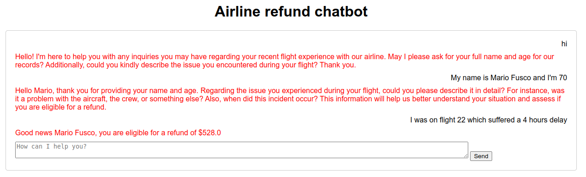

# Machine Learning + Symbolic Reasoning: a Quarkus story on Artificial Intelligence

| Hybrid Reasoning in a nutshell | 
|---| 
| Hybrid reasoning, also known as [Neuro-symbolic AI](https://en.wikipedia.org/wiki/Neuro-symbolic_AI), is a type of artificial intelligence mixing Machine Learning and Symbolic Reasoning in order to complement each other, covering with second the areas where the first falls short, like the lacks of reliability, reproducibility and transparency.<br/><br/>The main idea behind this project is showing, with simple but compelling examples, how hybrid reasoning, and in particular how mixing an LLM with a rule engine, could allow to implement chatbots in different business domains that are both user-friendly and capable of applying the business rules of that specific domain in a rigorous way and without suffering of any hallucinations. |

## Power is nothing without control

What you can do nowadays with LLM systems like ChatGPT is simply mind-blowing. I must admit that I cannot stop being surprised and from time to time literally jumping from my seat thinking: "I didn't imagine that AI could do ALSO this!". What is a bit misleading here is that what we now call and tend to identify with Artificial Intelligence is actually Deep Learning which is only a subset of all AI technologies available.


In other words Deep Learning is only a fraction of the whole AI-story. Moreover there are many situations where being surprised is the last thing that you may want. You don't want to jump from your seat when your bank refuses to concede you a mortgage without any human understandable or trackable reason, but only because an LLM said no. And even the bank may want to grant their mortgages only to applicants who are considered viable under their strict, well-defined and not questionable business rules.

In essence, the power and flexibility that a well-trained Deep Learning model gives you is virtually infinite, but as already discussed in many academical papers, given their statistical nature, they cannot be completely reliable and major drawbacks like hallucinations are unavoidable. 


In reality, what you often need, at least in some parts of your application, is a more confined and absolutely predictable control, in order to make it coherent with your business domain and obey flawlessly to its rules.

## Combining LLM flexibility and rule engine predictability

Given these premises why not mixing 2 very different and complementary AI branches like deep learning and symbolic reasoning? Moving forward with the mortgage example, this will give us a chance to implement an application with the corporate rigor required by the strict business rules of a bank, but queryable in the most human friendly possible way.

The goal of this project is demonstrating how [Quarkus](https://quarkus.io/), with the help of its [Drools](https://www.drools.org/) and [langchain4j](https://github.com/langchain4j/langchain4j) extensions, allows to easily integrate these 2 technologies and combine them to implement this mortgage example and other interesting use cases. 

## Installing and integrating a local LLM engine

langchain4j provides an abstraction on top of an underlying LLM, so you could switch between different implementations, and for example integrate ChatGPT, with very few configuration changes. In order to have a self-contained application, not relying on any external service, the current configuration uses on a locally running [Ollama](https://github.com/ollama/ollama) server. 

Ollama has a [library](https://ollama.com/library) with a quite long list of different models. This project uses by default the model called Mistral 7B that offers a good compromise between system requirements and capabilities. This choice has been configured in the Quarkus application.properties file as it follows: 

```
# Configure Ollama server to use Mistral 7B model
quarkus.langchain4j.ollama.chat-model.model-id=mistral
# Choose a low temperature to minimize hallucination
quarkus.langchain4j.ollama.chat-model.temperature=0.1
# Set timeout to 3 minutes (local LLM can be quite slow)
quarkus.langchain4j.ollama.timeout=180s
# Enable logging of both requests and responses
quarkus.langchain4j.ollama.log-requests=true
quarkus.langchain4j.ollama.log-responses=true
```

For detailed instructions of Ollama please refer to the [Ollama](https://github.com/ollama/ollama) documentation, but for example, you can start the containerized server with Mistral model by the following command in order to run this application:
```shell script
docker run -d -v ollama:/root/.ollama -p 11434:11434 --name ollama ollama/ollama
docker exec -it ollama ollama run mistral
```

## Running the application

### Using the dev mode

You can run your application in dev mode that enables live coding using:
```shell script
./mvnw compile quarkus:dev
```

Once the application is running you can connect to the [port 8080 of your localhost](http://localhost:8080/) and will obtain a simple index page only containing a list of links to the examples provided by this project. We will analyze these examples in more details in the second part of this document.

### Packaging and running the application

The application can be packaged using:
```shell script
./mvnw package
```
It produces the `quarkus-run.jar` file in the `target/quarkus-app/` directory.
Be aware that it’s not an _über-jar_ as the dependencies are copied into the `target/quarkus-app/lib/` directory.

The application is now runnable using `java -jar target/quarkus-app/quarkus-run.jar`.

If you want to build an _über-jar_, execute the following command:
```shell script
./mvnw package -Dquarkus.package.type=uber-jar
```

The application, packaged as an _über-jar_, is now runnable using `java -jar target/*-runner.jar`.

### Creating a native executable

You can create a native executable using: 
```shell script
./mvnw package -Dnative
```

Or, if you don't have GraalVM installed, you can run the native executable build in a container using: 
```shell script
./mvnw package -Dnative -Dquarkus.native.container-build=true
```

You can then execute your native executable with: `./target/quarkus-drools-llm-1.0.0-SNAPSHOT-runner`

If you want to learn more about building native executables, please consult https://quarkus.io/guides/maven-tooling.

## The mortgage example

As anticipated this first and simplest example combines Drools and a LLM with the purpose of allowing our user to interact with a bank chatbot in the smoothest and less structured possible way, but still applying the cold and inflexible [business rules](https://github.com/mariofusco/quarkus-drools-llm/blob/main/src/main/resources/org/hybridai/mortgage/mortgage.drl) of the bank when a decision about the grant of the mortgage has to be taken. 

Actually the implemented rule requirements are very basic, it's enough to have a sufficient income and of course to be adult, so when we type something like

```
Mario the firstborn of the Fusco family is born the 18th day of March 1974. Nowadays he works as software engineer and earns a quarter million a year.
```
the chatbot gently answers

```
Yes, mortgage can be granted to Mario Fusco
```

It's interesting to understand what's happening under the hood here. The application, through the langchain4j integration, asks to the LLM to extract from the input message the relavant data of the mortgage applicant.

```json
{"model":"mistral","prompt":"Extract information about a person from {\"message\":\"Mario the firstborn of the Fusco family is born the 18th day of March 1974 Nowadays he works as software engineer and earns a quarter million a year\"}. When income is null, it is set to 0. The response must contain only the JSON with person's data and without any other sentence.\nYou must answer strictly in the following JSON format: {\n\"firstName\": (type: string),\n\"lastName\": (type: string),\n\"birthDate\": (type: date string (2023-12-31)),\n\"income\": (type: integer),\n}","options":{"temperature":0.1,"num_predict":128,"top_p":0.9,"top_k":40},"stream":false}
```

As requested the LLM replies with a JSON containing those data

```json
{"firstName": "Mario", "lastName": "Fusco", "birthDate": "1974-03-18", "income": 250000}
```

that are automatically translated by langchain4j into an instance of the Person class. At this point it is straightforward to insert this Person object into a Drools session and let it evaluate the bank business rules against it.

The other nice, and in similar situations also very likely required, advantage of this solution is that a rule engine is a completely transparent and trackable form of artificial intelligence, so if you write something like:

```
Sofia the daughter of Mario Fusco is born on the 26th day of the ninth month of 2011. She is a very smart student.
```

not only the system correctly refuses to the grant the mortgage but also explain the reasons of this denial.

```
Mortgage cannot be granted to Sofia Fusco because [Sofia Fusco is too young, Sofia Fusco's income is too low]
```

## The password generator example

Having to generate a strong but easy to remember password is a very common task that from time to time we are asked to perform while browsing the internet, so why not taking advantage of the creativity of an LLM for this? 

Actually in this situation we don't need a fully reliable LLM. Conversly it is more important if it could be even more creative than usual. To do so we can raise the LLM temperature that is a parameter that influences the language model's output, determining whether the output is more random and creative or more predictable. A higher temperature will result in lower probability, i.e more creative outputs. 

Thanks to the Quarkus integration this is easily achievable defining [a second and _hotter_ LLM model](https://github.com/mariofusco/quarkus-drools-llm/blob/main/src/main/resources/application.properties#L13) and [configuring the password generator to use it](https://github.com/mariofusco/quarkus-drools-llm/blob/main/src/main/java/org/hybridai/password/PasswordGenerator.java#L8). 

In this way, we could for instance ask to the LLM to generate a random word that relates with `football` and it could reply `goalkeeper`.

Unfortunately almost never we're allowed to use such a simple word as a password. Actually a password should obey to a few simple rules, such as having a certain length and containing at least a capital letter, a digit, a symbol and the blood of a black roaster killed on a full moon night.

With these premises it is natural to [encode these rules](https://github.com/mariofusco/quarkus-drools-llm/blob/main/src/main/resources/org/hybridai/password/password.drl) with Drools and let the rule engine to apply them for you transforming the word originally suggested by the LLM into the more secure `G0alk&&p`.

## The airline chatbot example 

This example has been inspired by a recent chatbot horror story demonstrating once again how LLM are not completely reliable to be employed alone in business critical application. 


The idea here is to keep using the LLM to provide a friendly chatbot, but leveraging a more predictable rule engine when it is necessary to decide if the customer is eligible for a refund and of which amount.

In this example the [business rules](https://github.com/mariofusco/quarkus-drools-llm/blob/main/src/main/resources/org/hybridai/refund/calculator/refund.drl) are simple: a customer can have a refund of $2 for each minute of delay (if the flight had at least one hour of delay) plus a 10% in case of a senior customer (older than 65). 

The rule engine however is not only used to calculate the final refund amount, but also to define [another set of rules](https://github.com/mariofusco/quarkus-drools-llm/blob/main/src/main/resources/org/hybridai/refund/statemachine/statemachine.drl) implementing a state machine. This state machine has the purpose of guiding our chatbot through the different stages of the data acquisition, selecting right the data extractor for the current stage. In essence the architecture of our chatbot could be visually summarized in this way.


Giving a try to this setup you could for instance experience a conversation with our chatbot like the following.



This outcome is coeherent with the business rules described above, in fact the 4 hours, 240 minutes, correspond to a refund of $480, plus the 10% since the customer is 70 years old, giving a total of $528.
